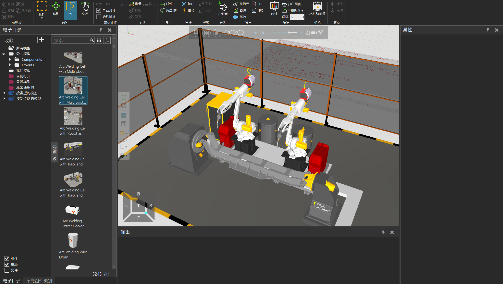
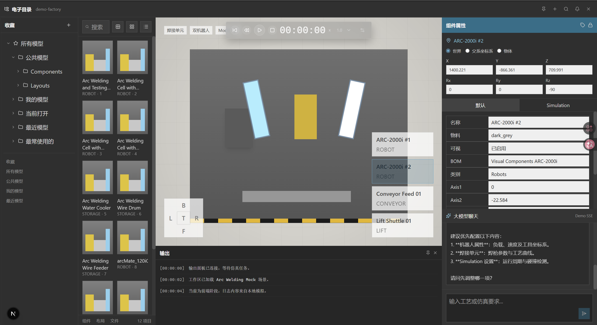
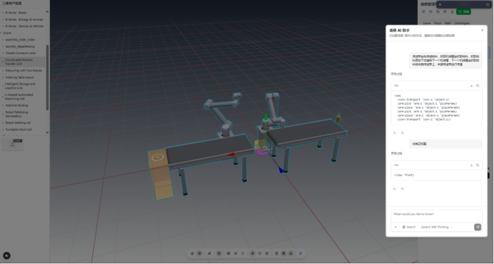

# Agentic Components

Agentic Components 是一个正在开发中的工业仿真平台，目标是对标 Visual Components，构建一个面向生产线建模、仿真调度、动画执行与 AI 协同配置的一体化工作台。

这个项目不只是做一个“带聊天框的 3D 页面”，而是要逐步实现一套完整的平台能力，并采用微服务架构组织平台服务、agent 能力和仿真执行能力：

- 类似 Visual Components 的工业建模与仿真工作区
- 基于大模型的场景理解、调度规划和仿真方案生成
- 基于 agent 的仿真执行链路，包括计划生成、任务协调、动画驱动和日志输出
- 面向设备、产线、机器人单元的可扩展仿真能力

## 项目目标

项目最终要实现的是一个对标 Visual Components 的平台，但核心差异不只是“复刻界面”，而是在仿真调度层引入大模型和 agent 系统。

目标平台将同时具备两层能力：

- 平台层：提供电子目录、场景编辑、属性面板、终端输出、AI 聊天、仿真控制等完整工作区
- Agent 层：理解用户输入、读取场景结构、生成仿真计划、协调设备行为，并驱动执行引擎完成动画与日志输出

在系统架构上，项目会明确采用微服务架构，将认证、场景管理、agent 调度、仿真执行、日志流、文件存储等能力拆分为可独立演进的服务，而不是把全部能力堆叠在单体应用中。

换句话说，这个项目的长期目标是把传统工业仿真平台的“建模能力”和 AI agent 的“理解与调度能力”结合起来，形成一个可交互、可规划、可执行的新型仿真系统。

## 对标关系

### 1. Visual Components

Visual Components 是本项目的重要对标对象。我们希望在交互结构、工作区布局、设备属性配置、仿真控制和整体使用体验上逐步靠近成熟工业仿真软件。



### 2. 当前项目

当前仓库里的前端工作区已经开始搭建，正在逐步补齐电子目录、3D 视口、属性面板、终端和 AI 聊天区域，并接入真实大模型流式输出。



### 3. 老版本项目

老版本项目已经实现过一套基于 agent 驱动的动画引擎。那套系统的价值不在于 UI，而在于它已经验证过一条关键路径：

- agent 可以理解场景和任务
- agent 可以生成执行计划
- 执行引擎可以根据计划驱动设备动画
- 日志、状态和过程反馈可以形成完整的仿真闭环

当前这个新项目，正是在老版本能力基础上重新构建新一代 agent，并用新的平台架构去完整对标 Visual Components。



## 当前定位

当前仓库处于平台开发阶段，重点是把“新一代工作区”和“新一代 agent 链路”重新搭起来。

现阶段的状态可以概括为：

- 前端工作区正在重建，布局已经接近目标形态
- 聊天区已经具备基于 SSE 的流式输出和打字机效果
- 通义千问 API 已经接入为当前大模型入口
- 后端目前主要承载认证与基础服务骨架
- 更完整的 agent 调度、仿真计划生成、动画执行和设备编排能力仍在开发中

所以现在看到的是“平台雏形 + 核心链路验证”，而不是最终成品。

## 核心愿景

这个项目最终希望支持这样的工作流：

1. 用户在工作区中搭建或打开一条产线场景
2. 用户通过自然语言描述仿真需求、调度目标或优化方向
3. Agent 读取场景结构、设备参数和连接关系
4. Agent 生成可执行的仿真计划，而不是只返回一段文本解释
5. 执行引擎根据计划驱动设备动作、动画过程和状态变化
6. 平台以 3D 画面、日志流、属性更新和对话反馈的形式持续呈现结果

这也是本项目与普通“LLM + UI demo”最本质的区别：目标是走向可执行仿真，而不是停留在文本问答。

## 系统构成

当前仓库主要由以下部分组成：

- `frontend/`
  基于 Next.js 16、React 19、TypeScript 和 Tailwind CSS 4 的前端工作区
- `backend/`
  基于 FastAPI 的后端骨架，当前以认证和基础接口为主
- `database/`
  数据库结构和初始化脚本
- `docs/`
  设计文档、路线规划、AI 仿真 agent 架构说明和资源截图

与长期目标对应，系统未来会逐步演进出三条主链路：

- UI 工作区链路：电子目录、视口、属性面板、聊天区、终端、仿真控制
- Agent 规划链路：意图解析、场景读取、拓扑分析、参数解析、计划生成、计划校验
- 仿真执行链路：执行调度、设备算法、动画引擎、日志输出、结果回传

同时，这三条链路会运行在微服务架构之上，逐步拆分为前端网关、认证服务、场景服务、agent 服务、仿真执行服务、消息与日志服务等独立模块。

## 当前已完成的方向

- 新版工作区基础布局已经建立
- OAuth 登录与基础认证链路已经搭建
- 聊天区已经支持真实大模型流式输出
- 已完成通义千问兼容模式的服务端代理接入
- 已保留并整理老版本 agent 仿真设计资料，作为新系统重建依据

## 正在推进的方向

- 继续完善前端工作区，使其更接近 Visual Components 的完整操作体验
- 将旧版 agent 驱动动画引擎的关键能力迁移到新架构
- 建立新的 agent 状态机、仿真计划结构和执行接口
- 补齐设备级算法、拓扑协同和调度执行闭环
- 让 AI 聊天从“流式回答”升级为“可驱动仿真任务的调度入口”

## 开发原则

这个项目的实现方向不是简单堆功能，而是围绕下面几件事持续推进：

- 先建立可演进的平台骨架，再逐步补齐复杂能力
- 尽量把“场景理解”和“动画执行”解耦，避免 agent 直接承担底层轨迹计算
- 保留老系统中已经验证过的执行经验，但用新的平台架构重新组织
- 在 UI、调度、执行三层之间建立清晰边界
- 采用微服务架构，让各核心能力可以独立部署、独立扩展和独立演进

## 快速开始

### 前端

```powershell
cd E:\project\Agentic Components\frontend
corepack pnpm install
corepack pnpm dev
```

### 后端

```powershell
cd E:\project\Agentic Components\backend
uv sync
uv run uvicorn main:app --reload --host 0.0.0.0 --port 8000
```

### 聊天区大模型配置

在 `frontend/.env.local` 中配置：

```env
DASHSCOPE_API_KEY=your-api-key
QWEN_MODEL=qwen-plus
```

## 文档入口

- [前端设计文档](docs/design/frontend/frontend_design_plan.md)
- [AI 仿真 Agent 设计](docs/design/AI/ai_simulation_agent_design.md)
- [开发计划](docs/design/development_plan_llm.md)
- [后端说明](backend/README.md)

## 项目现状总结

Agentic Components 的当前阶段，不是从零开始空想一个平台，而是在两个方向上同时推进：

- 向前对标 Visual Components，建立成熟工业仿真平台级的工作区与交互体验
- 向后承接老版本中已经实现过的 agent 驱动动画引擎，把它升级成更完整的新一代 agent 仿真系统

最终目标，是做出一个既像 Visual Components 一样可用于工业场景建模与仿真，又能利用大模型和 agent 真正参与调度、规划和执行的平台。
